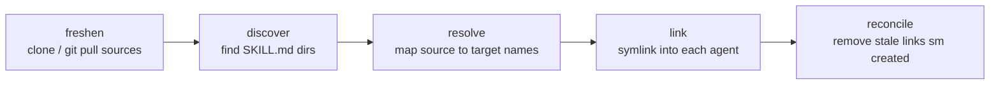

# skills-mapper (`sm`)

A cross-agent bridge for git-distributed AI coding skills.

## The problem

AI coding agents each want skills in their own directory, and each ecosystem
grows its own packaging. Publish a skill for Claude Code and Copilot users can't
use it; publish it for Copilot and someone on Pi is left out. That drift is the
problem.

A skill is just a directory containing a `SKILL.md` (YAML frontmatter with a
required `name`, optional `description`, then markdown). The open standard is to
distribute those directories as an ordinary **git repo** — nothing agent-specific.

`sm` is the last-mile adapter. You declare skill *sources* (git repos or local
paths) and which *agents* to install into. `sm` keeps the source repos current on
disk and symlinks their skills into every agent's skills directory. One library
serves all agents; no per-agent packaging, no transformation — placement only.

See [`VISION.md`](VISION.md) for the philosophy and [`docs/DESIGN.md`](docs/DESIGN.md)
for the detailed design.

## Prerequisites

- **Go 1.26+** (to build)
- **git** (used for all remote source fetches)

## Install

Build the binary into `./bin`:

```sh
make build          # produces ./bin/sm
```

Or install onto your `PATH` (into `$GOPATH/bin`):

```sh
make install        # go install ./cmd/sm
```

Verify:

```sh
sm                  # prints usage
```

## How to set up skills

The workflow is three steps: **init** a manifest, **edit** it to declare your
sources and agents, then **sync** to place the skills.

### 1. Create the manifest

```sh
sm init
```

This writes a starter manifest to the **global** location
`~/.config/skills-mapper/skills.toml` and exits if one already exists.

The starter looks like this:

```toml
[skills]
# core = { git = "https://github.com/you/skills", ref = "main" }

[agents]
claude-code = true
copilot     = true
hax         = false
pi          = false
oh-my-pi    = false

[options]
prefix_on_collision = false
```

### 2. Declare your sources and agents

Under `[skills]`, add one entry per source. Each source has an **alias** (the
manifest key — a stable handle for the CLI; it does not change skill names) and
**exactly one** of `git` or `path`:

```toml
[skills]
# A git repo of SKILL.md directories
gherlein = { git = "https://github.com/gherlein/skills", ref = "main" }

# Only a subdirectory of a repo
tools    = { git = "git@github.com:you/monorepo.git", ref = "v1.2.0", subdir = "skills" }

# A local directory (symlinked, never cloned)
local    = { path = "~/dev/my-skills" }
```

Source fields:

| Field    | Meaning                                                  |
| -------- | -------------------------------------------------------- |
| `git`    | Repo URL (SSH `git@host:owner/repo` or `https://…`)      |
| `ref`    | Branch, tag, or commit to check out (optional)           |
| `subdir` | Restrict discovery to this subdirectory of the repo      |
| `path`   | Local directory instead of a git repo (mutually exclusive with `git`) |

Under `[agents]`, set each agent you want to `true`. Unknown agent names fail
loudly. `sm` knows these agents and their skills directories:

| Agent         | Global directory                | Project directory   |
| ------------- | ------------------------------- | ------------------- |
| `claude-code` | `~/.claude/skills`              | `.claude/skills`    |
| `copilot`     | `~/.copilot/skills`             | `.github/skills`    |
| `hax`         | `~/.config/hax/skills`          | `.agents/skills`    |
| `pi`          | `~/.pi-go/skills`               | `.pi/skills`        |
| `oh-my-pi`    | `~/.config/agents/skills`       | `.agents/skills`    |

### 3. Sync

```sh
sm sync                 # clone/pull sources, then place symlinks
sm sync --dry-run       # show what would change, touch nothing
sm -v sync              # report each step (fetch, discover, resolve, link) on stderr
```

`-v`/`--verbose` may appear anywhere in the arguments and prints a running
account of what `sm` is doing to stderr, leaving stdout as the machine-readable
summary. Example:

```
updating cache: gherlein  git@github.com:gherlein/claude.git (ref main) -> ~/.local/share/skills-mapper/repos/github.com/gherlein/claude
discovered 3 skills from gherlein
resolved 3 links (prefix_on_collision=false)
target copilot: ~/.copilot/skills
  link emoji -> ~/.local/share/skills-mapper/repos/github.com/gherlein/claude/skills/emoji
```

`sync` prints a one-line summary of links added and removed, for example:

```
global sync: +12 -0
```

Inspect what's declared at any time:

```sh
sm list                 # alias, source, ref  (tab-separated)
```

### What `sync` does



- **freshen** — clone each git source (or `git pull` if already cached) and prune
  caches no longer in the manifest. Skipped on `--dry-run`.
- **discover** — walk each source for directories containing a standard-compliant
  `SKILL.md` (`.git`, `node_modules`, `vendor`, `dist`, `build`, and similar are
  ignored).
- **resolve** — compute the `source → target` name mapping. Clean, unprefixed
  names by default; a **duplicate skill name across sources fails loud** unless you
  set `prefix_on_collision = true`.
- **link** — create whole-directory symlinks in each enabled agent's skills dir.
- **reconcile** — remove links `sm` previously created that are no longer wanted.
  `sm` only ever touches links it made; a pre-existing file it didn't create is
  skipped with a warning and never clobbered.

## Scope: global vs. project

`sm` operates in one of two scopes:

- **global** (default) — the manifest at `~/.config/skills-mapper/skills.toml`;
  installs into each agent's home directory.
- **project** — a `skills.toml` at your repo root; installs into the repo's
  per-project agent directories.

Scope is auto-detected: if a `skills.toml` is found by walking up from the current
directory (stopping before `$HOME`), scope is **project**; otherwise **global**.
Force it with a flag:

```sh
sm --global sync
sm --project sync
```

To set up a **project** manifest, place a `skills.toml` at your repo root and run
`sm --project sync`. (`sm init` bootstraps the global manifest.)

## Common tasks

```sh
sm init                 # create the global starter manifest
sm sync                 # fetch sources and place skills
sm sync --dry-run       # preview changes
sm -v sync              # verbose: report each step on stderr
sm list                 # list declared sources
sm --project sync       # operate on the project manifest instead
sm add <git-url|path> --as core --ref main --sync   # register a source (and sync)
sm remove core --sync   # drop a source; prune its links and cache
sm update               # freshness only: clone/pull/prune caches
sm link                 # placement only from current caches (--dry-run)
```

- `sm add` writes the source into `skills.toml` (`--as` sets the alias, defaulting
  to the repo/dir name; `--ref` and `--subdir` are git-only). Without `--sync`,
  nothing is fetched or linked until the next `sm sync`.
- `sm remove <alias>` deletes the manifest entry; with `--sync` it also prunes the
  now-stale links and cache (`--keep-cache` preserves the clone).
- `sm update` and `sm link` are the two halves of `sync`, for when you want them
  separately — for example, scheduling `update` alone.

## Bundled skill

This repo ships its own AI-agent skill, [`skills/using-skills-mapper/`](skills/using-skills-mapper/SKILL.md),
which teaches a coding agent how to drive `sm`: the manifest format, the
edit-then-sync workflow, and the gotchas (scope auto-detection, dry-run
counting). `sm` can distribute it like any other
source — add the repo to your manifest and sync:

```toml
[skills]
sm-tool = { git = "https://github.com/gherlein/sm", ref = "main", subdir = "skills" }
# or, from a local checkout:
# sm-tool = { path = "~/src/tools/sm/skills" }
```

## Files and locations

| Path                                         | What                          |
| -------------------------------------------- | ----------------------------- |
| `~/.config/skills-mapper/skills.toml`        | Global manifest               |
| `<repo>/skills.toml`                          | Project manifest              |
| `~/.local/share/skills-mapper/repos/<host>/<owner>/<repo>` | Durable clone cache |
| `~/.local/share/skills-mapper/state.json`     | Tracked links (per target)    |

The config and data roots honor `XDG_CONFIG_HOME` and `XDG_DATA_HOME`.

## Project structure

```
cmd/sm/           entry point
skills/           bundled AI-agent skill(s), distributable by sm itself
internal/
  cli/            command wiring (init, sync, list, ...)
  config/         skills.toml parse / validate / write
  agents/         (agent, scope) -> skills directory registry
  cache/          durable git clone cache
  discovery/      find SKILL.md directories in a source tree
  resolve/        source -> target name mapping and collision handling
  link/           symlink apply / reconcile
  state/          tracked-link state file
```

## Build targets

```sh
make build        # build ./bin/sm
make test         # run all tests
make fmt          # go fmt
make vet          # go vet
make lint         # gofmt check + go vet
make install      # go install to GOPATH/bin
make clean        # remove build artifacts
make help         # list targets
```
