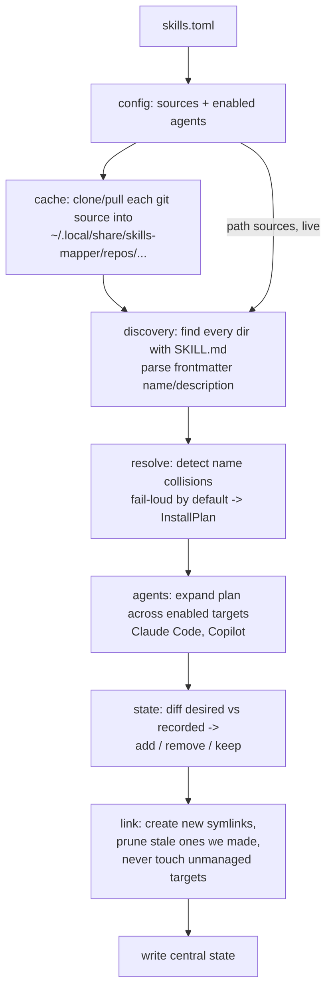

# skills-mapper (`sm`) — DESIGN

Status: design, pre-implementation. Date: 2026-08-21.
See [`../VISION.md`](../VISION.md) for purpose and the reverse-engineered `sk` reference.

## Purpose

`sm` is a cross-agent bridge for git-distributed AI coding **skills**. Skills are published
as ordinary git repos of `SKILL.md` directories (the open standard), and `sm` keeps those
repos current on disk and links their skills into every AI agent the developer uses — so one
library serves all agents, with no agent-specific packaging.

## Non-goals (deliberate)

- **No plugin support.** Bridging Claude Code plugins would let Claude users consume skills
  Copilot users can't — the exact drift `sm` exists to prevent. The standard is `SKILL.md`
  (and `AGENTS.md`); agents are expected to read it directly.
- **No hosted registry / account / auth.** No `skills.supply`-style backend, no OAuth, no
  token storage. Sources are git repos and local paths only.
- **No format transforms (for now).** Because there is one standard, "adapt to each agent"
  is pure placement (symlinks). A transform seam is left open but unused.
- **No project scope in the MVP.** A single global manifest; per-project manifests later.

## Core model

Two independent jobs, composed:

1. **Freshness** — clone the wanted skill repos into a durable cache and keep them updated
   (`git pull`).
2. **Placement** — discover skills across the cache, resolve names, and symlink each skill
   directory into every enabled agent's skills directory, reconciling safely.

Placement is four steps: **discover → resolve → link → reconcile.** This replaces GNU stow:
once `sm` computes the `source → target` mapping (which stow cannot express, because it needs
name remapping and standard-agnostic discovery), realizing it is a direct `os.Symlink` per
pair. stow would be a redundant second layer.

## Architecture

Small, single-purpose units with clear interfaces (each independently testable; pure logic
kept free of I/O):

```
cmd/sm/                 entrypoint
internal/config/        parse + validate skills.toml
internal/cache/         durable git clone/pull/prune cache        (git I/O)
internal/discovery/     walk repo -> []Skill (SKILL.md + frontmatter)   (pure over a fs)
internal/resolve/       collision detection + naming -> InstallPlan (pure)
internal/agents/        registry: agent -> target skills dir(s)
internal/link/          realize plan as symlinks per target        (fs I/O)
internal/state/         central state file + reconcile plan        (pure planner + fs)
internal/cli/           cobra commands wiring the above
```

The pure cores — `discovery`, `resolve`, `state` (the reconcile planner) — hold the bulk of
the correctness and are unit-tested in isolation. I/O units (`cache`, `link`) are thin and
covered by hermetic integration tests.

## Data flow



## Manifest — `skills.toml`

Global, at `~/.config/skills-mapper/skills.toml`. Explicit keyed handles (the key is a stable
human handle for CLI/status/overrides; it does **not** affect skill names, cache paths, or
placement).

```toml
[skills]                                     # alias = source
core  = { git = "https://github.com/acme/skills-core", ref = "main" }
handy = { git = "git@github.com:bob/handy.git" }          # ref optional -> default branch
elems = { git = "https://github.com/org/mono", subdir = "packages/skills", ref = "v1.2.0" }
mine  = { path = "~/dev/my-skills" }         # local; not cloned; live

[agents]
claude-code = true
copilot     = true

[options]
prefix_on_collision = false                  # default: fail loud on duplicate skill names
```

- Sources: `git` (with optional `ref` = branch|tag|commit, and optional `subdir`) or `path`.
- No `gh` shorthand, no plugin/registry source types.
- Unknown `[agents]` keys and unknown declaration keys are validation errors.

## Clone cache & update

- **Durable** cache (it is the symlink source, not disposable):
  `~/.local/share/skills-mapper/repos/<host>/<owner>/<repo>`.
- `git` sources: full clone (skill repos are small; makes `pull`/tags/ref-switches robust);
  checkout `ref` after clone. `path` sources are used in place (always live, no clone).
- **update** = per source: `git fetch`, then reconcile to `ref` (`pull` for a branch,
  re-checkout for a tag/commit). Sources removed from the manifest have their cache pruned.
- Whole-dir symlinks mean a successful `pull` is instantly live; re-linking is only needed
  when a pull adds/removes a skill dir (handled by reconcile).

## Skill discovery & naming

- **Discovery**: a skill is any directory that directly contains a `SKILL.md`. `sm` walks
  each source (skipping `.git`, `node_modules`, etc.) and collects them — flattening every
  layout (`skills/<name>`, root `<name>`, single root `SKILL.md`) into a flat
  `(alias, name, sourceDir)` list. `name` = the source directory name.
- **Frontmatter**: parse `SKILL.md` YAML frontmatter; `name` required (validate it equals the
  directory name — warn on mismatch), `description` optional. Missing/unparseable frontmatter
  → warn and skip that skill.
- **Naming / collisions**: default install name = the clean skill name (no prefix), so folder
  == frontmatter `name` == what every agent sees. A **duplicate name across enabled sources
  fails the run** (report both sources; suggest rename / drop / `--as` / `prefix_on_collision`).
  Opt-in `prefix_on_collision` installs as `<alias>-<name>` (accepts a folder/frontmatter
  mismatch as the trade-off).

## Agent registry

Five agents, each with a global and a project skills dir. Extensible — adding an agent is one
registry entry.

| agent | global | project |
| --- | --- | --- |
| `claude-code` | `~/.claude/skills` | `./.claude/skills` |
| `copilot` | `~/.copilot/skills` | `./.github/skills` (code-review) |
| `hax` | `~/.config/hax/skills` | `./.agents/skills` |
| `pi` (pi-go) | `~/.pi-go/skills` | `./.pi/skills` |
| `oh-my-pi` (omp) | `~/.config/agents/skills` | `./.agents/skills` |

Notes:
- **omp owns no dir** — it reads Claude/Codex/Pi/Agents dirs. We map it to the **Agents**
  convention (`~/.config/agents/skills`); it is partly redundant with `claude-code`/`pi` (once
  those are populated omp already sees them) but included as an explicit target.
- **pi's `~/.pi-go/skills` is a symlink into the user's stow-managed dotfiles** — `sm` writes
  links through it into the dotfiles tree, by the user's choice.
- `hax` and `oh-my-pi` share the project dir `./.agents/skills` (one link set serves both).

Install into whatever `[agents]` enables (create the dir if missing). No `--version` gating;
`list` may warn if an enabled agent's binary is absent, but never skips.

## Scope

- **Global** (default when no project manifest is found): manifest `~/.config/skills-mapper/
  skills.toml`, installs into the global dirs above.
- **Project**: a `skills.toml` discovered by walking up from cwd (stopping at `$HOME`),
  installs into the project dirs above under the repo root. `--global` / `--project` force a
  scope. Central state keys targets by absolute path, so both scopes coexist.

## Placement, state & reconciliation

- **Link**: for each enabled target and each resolved skill, create a whole-directory symlink
  `target/<name> -> <cache-or-path>/<sourceDir>`. Segment-validate names (no `/ \ . ..`);
  ensure links stay within the target dir.
- **State**: one central file `~/.local/share/skills-mapper/state.json`, recording per target
  dir the set of link names `sm` created (+ their sources, + `updated_at`). Central (not
  sk's per-dir) for simpler reasoning; reconcile is idempotent so a stale entry self-heals.
- **Reconcile**: add newly-desired links; **remove only links we previously recorded** that
  are no longer desired; **never overwrite or delete a target we did not create** (protects
  hand-placed skills and Claude Code's own files — such a pre-existing target is reported and
  skipped). Only symlinks are ever removed, never real directories.

## Commands (`sm`)

| Command | Does |
| --- | --- |
| `sm sync` | update caches → discover → resolve → link → reconcile (the everyday verb). `--dry-run`, `--only <alias>` |
| `sm update [alias…]` | freshness only: clone/pull/prune (the half to schedule) |
| `sm link` | placement only from current caches; reconcile. `--dry-run` |
| `sm list` / `sm status` | sources, resolved ref, #skills, link locations; flag collisions/dangling/unmanaged |
| `sm add <git-url\|path>` | append a source. `--as`, `--ref`, `--subdir`, `--sync` |
| `sm remove <alias>` | drop from manifest; prune links + cache. `--keep-cache` |
| `sm init` | write a starter `skills.toml` |

All commands accept `--global` / `--project` to force scope. **Automation:** schedule `sm
sync` (not bare `update`) so caches and agent dirs stay consistent in one shot.

## Error handling

- **Collision** → fail the run, apply nothing, report both sources + the skill + fixes.
- **Bad/missing frontmatter** → warn + skip that skill, continue, report count.
- **`name` ≠ dir name** → warn.
- **Pre-existing unmanaged target** → never overwrite; report + skip.
- **git failure / bad ref / missing path source** → per-source error, continue others,
  non-zero exit, summary.
- **Interrupted run** → state written only after a successful apply; re-running `sm sync`
  repairs partial state (idempotent).

## Testing

- **Unit, table-driven** (pure cores): discovery (all layout variants → flat list),
  frontmatter parse/validate, collision detection, reconcile planner (prev-state + desired →
  add/remove/keep + conflicts).
- **Integration, hermetic (no network)**: fake sources in temp dirs — `git init` + local bare
  remotes for `git` sources (clone/pull/ref offline), plain dirs for `path`; fake agent home
  dirs. Assert symlinks, state contents, collision-fails-cleanly, dangling-prune,
  unmanaged-target protection, add/remove/prune.
- Built and run through a `Makefile` (`build`/`test`/`lint`); idiomatic Go stdlib `testing`.

## Open / future

- More agents in the registry (Codex, Amp, OpenCode) — additive registry entries.
- `AGENTS.md` distribution (single-file-per-repo), if wanted, as a sibling concern.
- Optional per-agent transform seam, only if a future agent needs a non-standard shape.
- Claude-plugin/marketplace *import* — deliberately excluded (drift); revisit only if needed.
